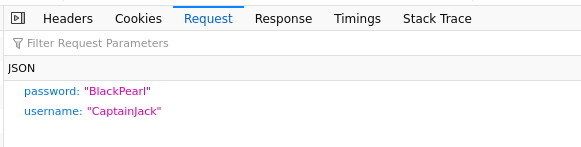
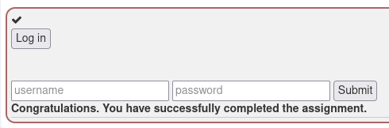

# h3 Attaaack

# Table of Contents
1. [Practical Threat Intelligence and Data-Driven Threat Hunting - Chapter 4](#practical-threat-intelligence-and-data-driven-threat-hunting---chapter-4)
2. [Mitre ATT&CK](#mitre-attack)

    2.1. [Tactic](#tactic)

    2.2. [Technique and Sub-Technique](#technique-and-sub-technique)

    2.3. [Procedure](#procedure)

3. [WebGoat: A3 - Sensitive Data Exposure - 2 Let's try](#webgoat-a3---sensitive-data-exposure---2-lets-try)
4. [WebGoat: SQL Injection (advanced)](#webgoat-sql-injection-advanced)

# Practical Threat Intelligence and Data-Driven Threat Hunting - Chapter 4
## The ATT&CK Framework
The ATT&CK framework is a model for cyber adversary behavior. It studies the tactics, techniques, and procedures (TTPs) of adversaries and provides a common language to describe cyber attacks. This language is used to better understand the threat, and to better communicate between security teams and other stakeholders.

### Tactics, Techniques, Sub-Techniques, and Procedures
There is 14 tactics that are used:
- Reconnaissance: The adversary is gathering information about the target.
- Resource Development: The adversary is developing resources to support operations. It tries to cover the process of assessing the resources needed to conduct an attack, and then developing those resources.
- Initial Access: The adversary gains access to the target environment. Those are the very first steps of an attack.
- Execution: The adversary uses various means to run malicious code or commands on a victim's system.
- Persistence: The adversary maintains access to a victim's system even if the system is restarted or the network connection is lost.
- Privilege Escalation: The adversary attempts to gain elevated or unrestricted access to resources.
- Defense Evasion: The adversary attempts to avoid detection or impede analysis of their activity.
- Credential Access: The adversary attempts to steal credentials from a victim.
- Discovery: The adversary attempts to gather information about the victim's environment.
- Lateral Movement: The adversary attempts to move laterally to other systems within the victim's network.
- Collection: The adversary attempts to gather information from the victim.
- Command and Control: The adversary attempts to communicate with systems under their control.
- Exfiltration: The adversary attempts to remove or steal data from the victim's network.
- Impact: The adversary attempts to directly impact the victim's systems or data. He/She will try to prevent the victim from accessing his/her systems or data.

The porcedure is the way the adversary is using to achieve his/her goal. It is the combination of the technique and the sub-technique.

### The ATT&CK Matrix
The ATT&CK matrix is a grid that shows the different tactics and techniques. It is a good way to visualize the different techniques and tactics. It is also a good way to see the different techniques that are used by the same tactic.
There are big headings for the tactics (listed above) and sub-headings for the techniques. The techniques are divided into sub-techniques. The sub-techniques are the different ways to achieve the same technique. There is also a description for each technique and sub-technique.

### The ATT&CK Navigator
The ATT&CK Navigator is a tool that allows you to visualize the ATT&CK matrix. It is a good way to see the different techniques and tactics that are used by an adversary. It is also a good way to see the different techniques that are used by the same tactic.

## Mapping with ATT&CK
Formbook is an infostealer that is more advanced than most other infostealers. It is a modular malware that can be used to steal information from a victim's system. It can steal information from the following sources:
- Browser
- Clipboard
- File
- Keylogger
- Network
- Etc.

It belongs to the following tactics:
- Credential Access
- Collection

# Mitre ATT&CK
- Tactic: A tactic is a method or approach used by an adversary to achieve a goal. It is a high-level description of the behavior of an adversary. It is a way to classify the different techniques and procedures.
Tactics represent the "why" of an ATT&CK technique or sub-technique. It is the goal of the adversary. It is the reason why the adversary is using a specific technique or sub-technique.
Refer to this URL for more information: https://attack.mitre.org/tactics/enterprise/

    Example: Reconnaissance

- Technique and Sub-Technique: A technique is a specific method used by an adversary to achieve a goal. It is a low-level description of the behavior of an adversary. It is a way to classify the different procedures.
Refer to this URL for more information: https://www.f5.com/labs/learning-center/mitre-attack-what-it-is-how-it-works-who-uses-it-and-why

    Example: Active Scanning

    A sub-technique is a specific method used by an adversary to achieve a goal. It is a low-level description of a technique.
    Refer to this URL for more information: https://www.f5.com/labs/learning-center/mitre-attack-what-it-is-how-it-works-who-uses-it-and-why

    Example: Active Scanning - Scanning IP Blocks

- Procedure: A procedure is the way the adversary is using to achieve his/her goal. It is the combination of the technique and the sub-technique.

    Example: Active Scanning - Scanning IP Blocks - TeamTNT (It can scan specific IP blocks)

# WebGoat: A3 - Sensitive Data Exposure - 2 Let's try
## Insecure Login
Click the "log in" button to send a request containing login credentials of another user. Then, write these credentials into the appropriate fields and submit to confirm. Try using a packet sniffer to intercept the request.

First, I had to press the "log in" button to send a request containing login credentials of another user.
Then, I inspected the POST request with Firefox Developer Tools (I choose the Network tab and I clicked on the POST request, because all other requests were GET requests).
Then, I checked the Request tab and I saw that the credentials were not encrypted.

Then, I just had to write these credentials into the appropriate fields and submit to confirm.

# WebGoat: SQL Injection (advanced)
For this voluntary part, you can refer to the following URL:
https://github.com/TabogaBr/h2_goat#webgoat-bonus